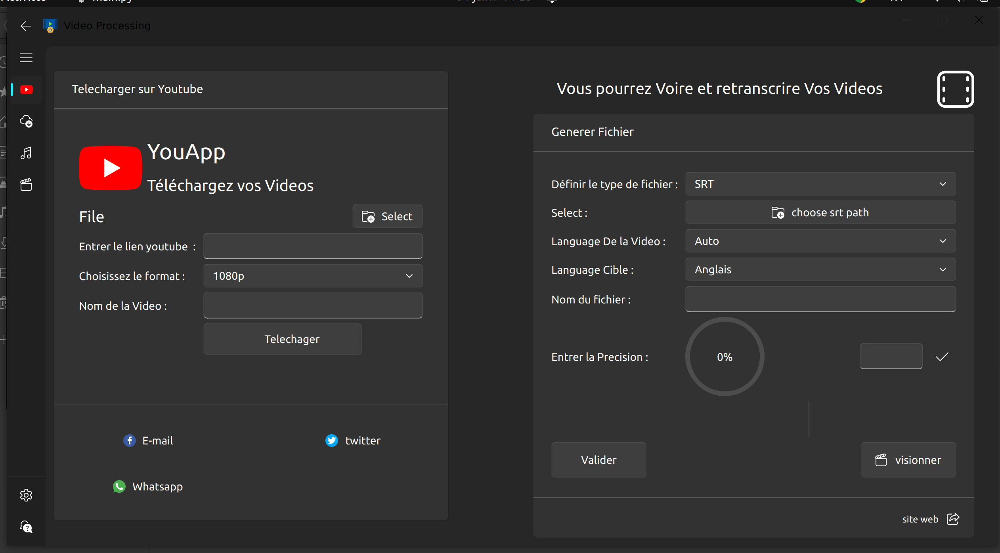
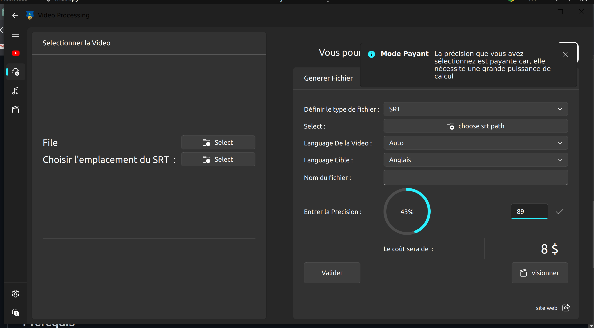

# Video Processing ..#Nom de l'application

This application has been rigorously developed to ensure the maintainability and evolution of the code without compromising the core.


## Fonctionnalités

This application allows you to:

- Watch videos
- Transcribe watched videos
- Download videos from YouTube
- View videos along with their transcriptions
- Generate a PDF or SRT file regarding the content of the video or the video timestamp

## Youtube Place Interface


## Prérequis
- Python 3.x
- PyQt5
- QFluentWidgets
- googletrans
...
everything is listed in
requirements.txt

## Installation

1. Clone this repository:
   ```bash
   git clone https://github.com/chikatsi-Joel/solid_processing_movie.git
